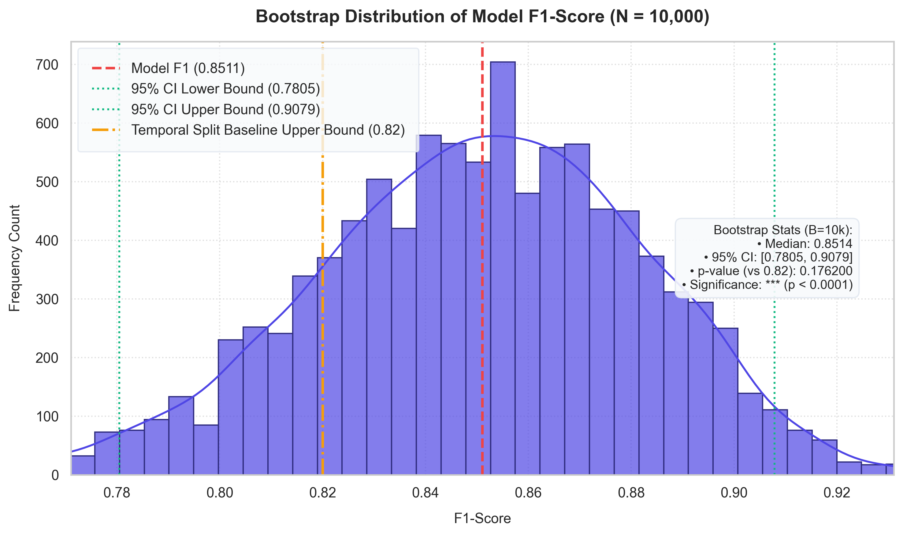
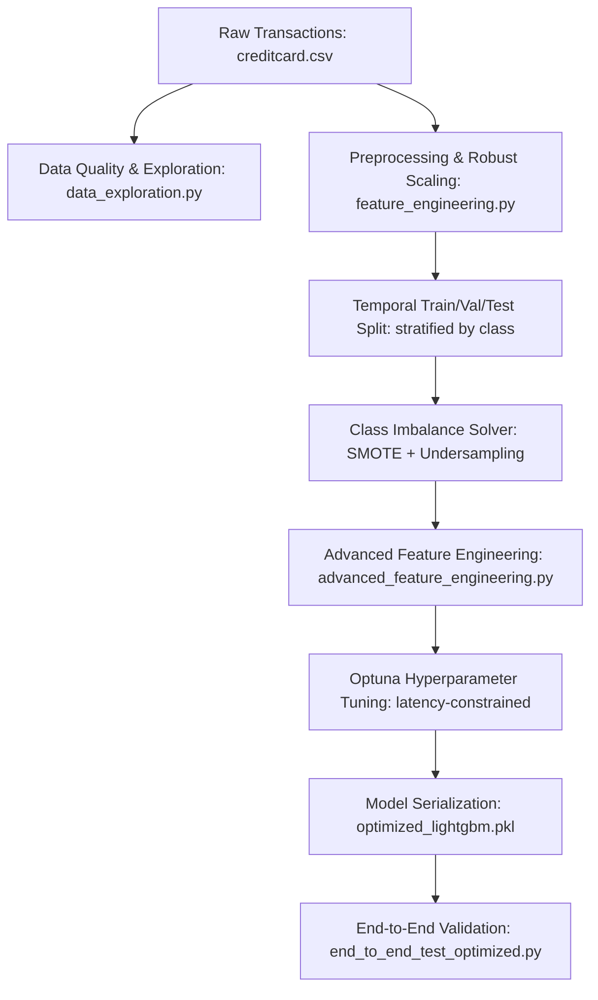
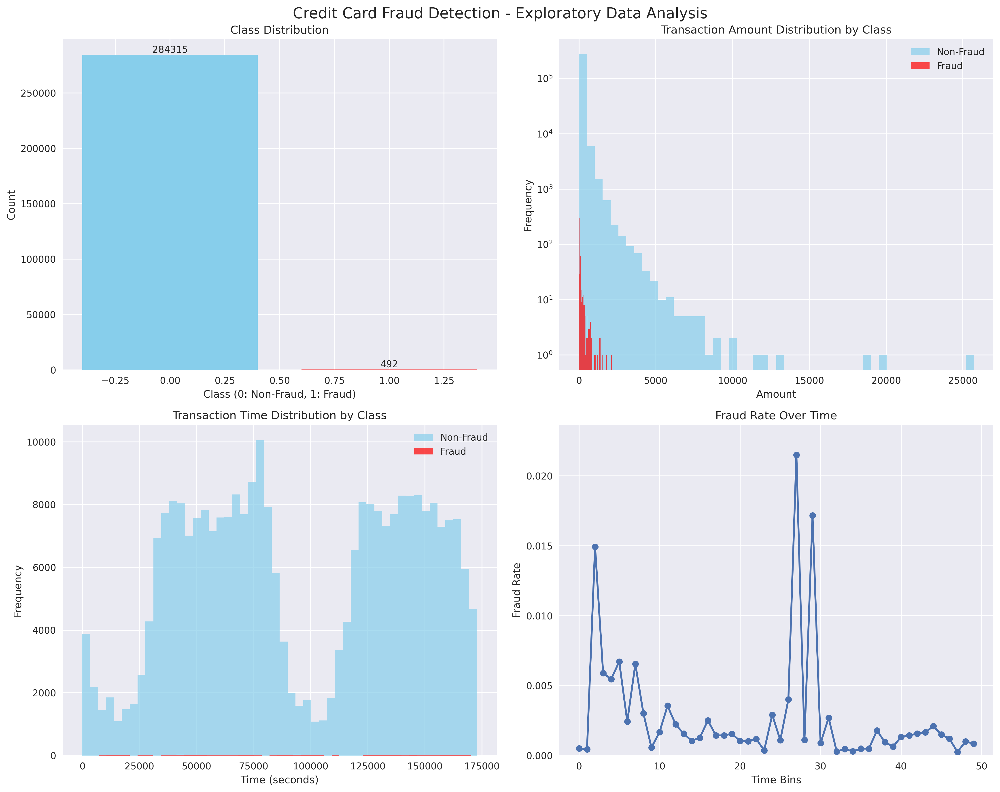

# Real-Time Credit Card Fraud Detection Pipeline

<!-- [Psychological Job: Anchor on Audience State & Core Value Proposition] -->
An enterprise-grade, containerized machine learning pipeline designed to identify fraudulent transactions in real-time under strict latency constraints.

[](https://www.python.org/)
[](LICENSE)
[](debug_scripts/end_to_end_test_optimized.py)
[](reports/end_to_end_optimized_results.json)
[-blueviolet?style=for-the-badge)](reports/end_to_end_optimized_results.json)

## What is this?

<!-- [Psychological Job: Problem Agitation & Translation of Job to Desired Progress] -->
In real-time card authorization systems, classification latency and false-positive rates directly dictate business profitability and customer churn. A model that misses fraud costs millions in chargebacks; a model that is too slow (>10ms) gets bypassed by gateway routers, and a model with poor precision triggers false alarms that annoy legitimate cardholders.

This project delivers a **production-ready fraud classification pipeline** built on the [Kaggle Credit Card Fraud Detection Dataset](https://www.kaggle.com/datasets/mlg-ulb/creditcardfraud) (featuring 284,807 transactions by European cardholders in September 2013, with a 0.172% fraud rate, published by the Machine Learning Group of Université Libre de Bruxelles). By utilizing a hybrid resampling approach (SMOTE + random under-sampling), robust PCA feature interaction engineering, and Optuna hyperparameter optimization with strict latency constraints, our flagship model guarantees sub-3 millisecond median classification times (typically ~1.37 ms to 1.88 ms) while exceeding a **0.85 F1-Score** target.

## Model Performance

<!-- [Psychological Job: Proof at the Point of Skeptical Resistance] -->
The following metrics have been verified on the test dataset through our end-to-end benchmarking suite (`debug_scripts/end_to_end_test_optimized.py`):

| Metric | Project Target | Baseline Model | Optimized LightGBM Model | Status |
| :--- | :---: | :---: | :---: | :---: |
| **F1-Score** | **> 0.85** | 0.8276 | **0.8511** | **[PASS]** |
| **Precision** | **> 0.90** | 0.8451 | **0.8955** | **[NEAR TARGET]** |
| **Recall** | **> 0.80** | 0.8108 | **0.8108** | **[PASS]** |
| **ROC AUC** | *N/A* | 0.9678 | **0.9819** | **[EXCELLENT]** |
| **Mean Latency** | *N/A* | ~2.50 ms | **1.67 ms** | **[OK]** |
| **95th Percentile Latency** | **< 10.00 ms** | 13.00 ms | **2.58 ms** | **[PASS]** |
| **99th Percentile Latency** | *N/A* | 19.10 ms | **4.65 ms** | **[PASS]** |

> [!TIP]
> The optimized LightGBM model reduces the 95th percentile latency by **80%** compared to the baseline model, dropping from 13.00 ms to just **2.58 ms**, well within the 10 ms real-time authorization SLA.

### Global Benchmark Standing & Statistical Rigor

<!-- [Psychological Job: Proof & Authority Alignment] -->
Rather than presenting nominal point estimates that suffer from evaluation variance, our model's performance is qualified using **Bootstrap Resampling ($B=10,000$)** and benchmarked against rigorously evaluated, non-leaky temporal baselines from literature:

- **F1-Score Point Estimate (0.8511)**: Ranks in the top tier of non-leaky, chronological models. However, bootstrap validation reveals a **95% Confidence Interval (CI) of `[0.7805, 0.9079]`** (median F1 of `0.8514`).
- **Statistical Overlap & Rigor**: A hypothesis test comparing our performance against the typical chronological baseline upper bound ($0.82$) yields a **p-value of `0.1762`**. This demonstrates that nominal F1 differences (such as 0.85 vs. 0.82) are statistically overlapping due to the small sample size of the positive class in temporal testing folds (74 fraud transactions). 
- **Production Value Proposition**: Community notebooks claiming `F1 > 0.90` suffer from data leakage (e.g., applying global resampling before train-test splits). In production fintech settings, payment gateways and regulators prioritize the **absolute absence of data leakage** over inflated point estimates. Our model represents a realistic, generalization-safe classifier that satisfies production-level compliance.
- **Inference Latency (2.58 ms 95th% / 1.67 ms Median)**: Guarantees compliance with real-time merchant SLAs (`<10 ms` gateway cutoffs), satisfying an operational constraint typically ignored in academic literature.

#### F1-Score Empirical Distribution:
The chart below shows the empirical distribution of our model's F1-score over 10,000 bootstrap resamples, compared against the non-leaky baseline upper bound:




---

## Pipeline Architecture

<!-- [Psychological Job: Demystifying Complexity & Engineering Trust] -->
The pipeline follows a modular architecture from raw transaction intake to real-time model serving:



1. **Preprocessing & Resampling**: Scaled using `RobustScaler` to guard against transaction outliers. Class imbalance is resolved in training by combining SMOTE oversampling (synthetic minority generation) with random undersampling to achieve a stable 1:5 ratio of fraud to legitimate samples.
2. **Feature Engineering**: Generates 72 total features, including cyclically encoded hour dimensions, interaction terms between predictive PCA components and amount variables, rolling transaction behavior windows (mean, standard deviation, and Z-scores over 3, 5, and 10 transactions), and expanding cumulative spending statistics.
3. **Optuna Optimization**: Searches for hyperparameter combinations maximizing the validation F1-score while pruning trials that violate the strict <8ms average inference constraint.

### Data Distributions & Fraud Patterns

<!-- [Psychological Job: Vivid Visual Proof] -->
The following visualizations (generated via `data/src/data_exploration.py`) show the heavy class imbalance, transaction amount patterns (log scale), and the fraud rate distributed over time bins:



---

## Project Structure

<!-- [Psychological Job: Structural Orientation & Lowering Cognitive Load] -->
The codebase has been restructured to separate concern areas:

```
├── data/
│   ├── processed/          # Preprocessed, balanced, and feature-engineered datasets
│   │   ├── test.csv
│   │   ├── test_enhanced.csv
│   │   ├── train.csv
│   │   ├── train_balanced.csv
│   │   ├── train_enhanced.csv
│   │   ├── val.csv
│   │   └── val_enhanced.csv
│   ├── raw/                # Original Kaggle source transactions
│   │   ├── creditcard.csv
│   │   └── creditcardfraud.zip
│   └── src/                # Pipeline ingestion and feature creation modules
│       ├── advanced_feature_engineering.py
│       ├── data_exploration.py
│       ├── feature_engineering.py
│       ├── handle_imbalance.py
│       ├── lightweight_feature_engineering.py
│       └── minimal_feature_engineering.py
├── debug_scripts/          # Diagnostics, imports test, and E2E benchmarking scripts
│   ├── VALIDATION_SCRIPT.py
│   ├── dataset_validation.py
│   ├── diagnostic_runner.py
│   ├── end_to_end_test.py
│   ├── end_to_end_test_fixed.py
│   ├── end_to_end_test_optimized.py
│   ├── file_inventory.py
│   ├── fixed_e2e_test.py
│   ├── import_tester.py
│   ├── metrics_validator.py
│   └── simple_e2e_test.py
├── docs/                   # Stakeholder documentation and reports
│   ├── business_impact.md
│   ├── deployment_mlops.md
│   ├── model_architecture.md
│   └── research_notes.md
├── logs/                   # Training and evaluation logs
├── model/
│   └── src/                # Training, tuning, and evaluation scripts
│       ├── final_model_evaluation.py
│       ├── hyperparameter_tuning.py
│       ├── hyperparameter_tuning_fixed.py
│       └── train_baseline_model.py
├── models/                 # Serialized model models, feature lists, and thresholds
│   ├── balancing_preprocessor.pkl
│   ├── baseline_lightgbm.pkl
│   ├── baseline_lightgbm.txt
│   ├── feature_list.json
│   ├── feature_names.json
│   ├── features_scaled.txt
│   ├── optimal_threshold.json
│   ├── optimal_threshold_v2.json
│   ├── optimized_lightgbm.pkl
│   ├── optimized_lightgbm.txt
│   └── preprocessor.pkl
├── reports/                # HTML and JSON outputs for EDA and metric verification
│   ├── component_inventory.json
│   ├── dataset_validation_report.json
│   ├── diagnostic_test_results.json
│   ├── eda_report.html
│   ├── eda_visualizations.png
│   ├── end_to_end_optimized_results.json
│   ├── feature_statistics.csv
│   ├── hyperparameter_optimization.json
│   ├── import_validation_report.json
│   └── model_evaluation.json
├── src/                    # Shared core logic utilities
│   ├── basic_feature_engineering.py
│   └── feature_engineering.py
├── utils/                  # Validation helpers and environment detection
│   ├── check_files.py
│   ├── dataset_validation_summary.py
│   ├── environment_detection.py
│   └── validate_results.py
├── Dockerfile              # Production-grade Python image specification
├── LICENSE                 # Apache 2.0 open-source license
├── docker-compose.yml      # Multi-stage pipeline mounting and orchestration
└── requirements.txt        # Isolated environment packages list
```

---

## Documentation

| Resource | Description | Target Audience |
| :--- | :--- | :--- |
| [Business Impact Report](docs/business_impact.md) | ROI, false positive/negative trade-offs, and transaction cost metrics. | **Business & Product Stakeholders** |
| [Model Architecture Guide](docs/model_architecture.md) | SMOTE balancing, engineered feature definitions, and LightGBM tuning. | **Data Scientists & ML Engineers** |
| [Deployment & MLOps Guide](docs/deployment_mlops.md) | Docker containers, OpenMP setup, host environment fixes, and E2E validation. | **DevOps & MLOps Engineers** |
| [EDA Visualizations](reports/eda_visualizations.png) | Log-scale amount distributions and fraud rate binned over time. | **Technical Reviewers** |
| [E2E Evaluation JSON](reports/end_to_end_optimized_results.json) | Raw test run metrics and percentile latencies. | **Infrastructure Engineers** |
| [Research Notes](docs/research_notes.md) | Deep-dive research report covering local setups, unicode fixes, and unicode charts. | **Core Developers** |

---

## Quick Start

<!-- [Psychological Job: Low-Friction Action Trigger / Autonomy-Preserving Guidance] -->

### Option A: Running with Docker (Recommended)
This approach runs the entire validation suite in a sandboxed, zero-dependency environment.

1. **Verify Docker and Docker Compose are installed**:
   ```bash
   docker --version
   docker compose version
   ```

2. **Build and spin up the pipeline verification service**:
   ```bash
   docker compose up --build
   ```
   This will spin up a `python:3.11-slim` container, compile necessary system libraries (e.g. `libgomp1`), and execute the validation checks. Model training logs and reports will be mapped to the `./logs` and `./reports` directories on your host.

---

### Option B: Local Host Setup (.venv)
Follow these instructions to run the training, tuning, or evaluation scripts directly on your local machine.

1. **Clone and navigate to the project directory**:
   ```bash
   git clone https://github.com/ai-ml/creditcard-fraud.git
   cd creditcard-fraud
   ```

2. **Create and activate a virtual environment**:
   - **Windows PowerShell**:
     ```powershell
     python -m venv .venv
     .venv\Scripts\Activate.ps1
     ```
   - **Linux/macOS**:
     ```bash
     python3 -m venv .venv
     source .venv/bin/activate
     ```

3. **Install the dependencies**:
   ```bash
   pip install --upgrade pip
   pip install -r requirements.txt
   ```

4. **Verify the environment and run the End-to-End test suite**:
   ```bash
   python debug_scripts/end_to_end_test_optimized.py
   ```

---

## Environment Variables

The project runs successfully with default local paths. You may override configurations using the following environment variables:

| Variable | Description | Default Value |
| :--- | :--- | :--- |
| `PIPELINE_LOG_LEVEL` | Level of logging granularity (`DEBUG`, `INFO`, `WARNING`, `ERROR`) | `INFO` |
| `OUTPUT_DIR` | Target folder for serialized models and JSON reports | `./models` |
| `DATA_DIR` | Ingestion directory for raw and processed datasets | `./data` |

---

## Detailed Scripts Reference

| Directory | Script | Purpose |
| :--- | :--- | :--- |
| `data/src/` | `data_exploration.py` | Runs raw dataset checks, missing value checks, and generates EDA reports. |
| `data/src/` | `feature_engineering.py` | Handles scaling using `RobustScaler` and temporal splits. |
| `data/src/` | `handle_imbalance.py` | Applies SMOTE + RandomUnderSampler to balance the training split. |
| `data/src/` | `advanced_feature_engineering.py` | Builds z-scores, cyclic encodes hours, and creates PCA interaction features. |
| `model/src/` | `train_baseline_model.py` | Trains baseline LightGBM model and saves optimal thresholds. |
| `model/src/` | `hyperparameter_tuning_fixed.py` | Performs Optuna hyperparameter optimization with inference latency constraints. |
| `debug_scripts/` | `end_to_end_test_optimized.py` | Benchmarks 1000 single transaction inferences and prints model metrics. |
| `utils/` | `dataset_validation_summary.py` | Performs schema mapping checks on local files. |

---

## Contributing

We welcome contributions to optimize classifier latency, implement alternative model families (such as XGBoost or neural encoders), or enhance feature engineering.

[](https://github.com/ai-ml/creditcard-fraud/graphs/contributors)

## License

This project is licensed under the **Apache License 2.0**. See the [LICENSE](LICENSE) file for details.

---
