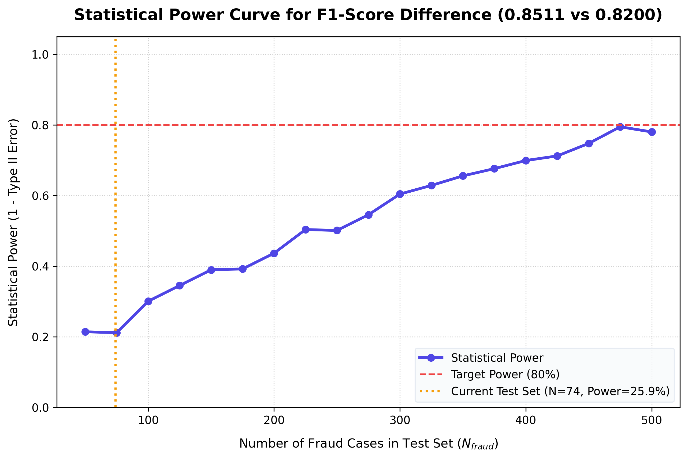

# Model Architecture Guide: Fraud Classification Pipeline

This document details the machine learning design decisions, preprocessing choices, feature engineering, and optimization strategies implemented in the Credit Card Fraud Detection Pipeline.

---

## 1. Dataset & Preprocessing

The pipeline ingests the [Kaggle Credit Card Fraud Detection Dataset](https://www.kaggle.com/datasets/mlg-ulb/creditcardfraud), compiled and published by the **Machine Learning Group of Université Libre de Bruxelles (ULB)**. The dataset contains **284,807 transactions** made by European cardholders in September 2013, with a severe class imbalance of only **492 frauds (0.172%)**. 

### Data Splits & Preprocessing Flow
1. **Temporal Partitioning**: The data is split chronologically into Train (60%), Validation (20%), and Test (20%) datasets. This simulates real-world deployment where models are evaluated on future transactions relative to their training period.
2. **Robust Scaling**: Numerical columns (specifically transaction amounts) are scaled using `scikit-learn`'s `RobustScaler`. By scaling using the median and interquartile range (IQR), we prevent extreme outliers from distorting feature variance:
   $$X_{\text{scaled}} = \frac{X - \text{median}}{\text{IQR}}$$

---

## 2. Resolving Class Imbalance

To prevent the model from converging on the majority class (predicting "legitimate" for all samples), we apply a hybrid resampling strategy during training using the `imbalanced-learn` library:

1. **SMOTE (Synthetic Minority Over-sampling Technique)**: Generates synthetic fraud samples along the line segments joining k-nearest neighbors of existing fraud cases, raising the minority class representation.
2. **Random Under-Sampling (RUS)**: Randomly discards majority class samples to reduce training time and balance the final representation.
3. **Resampling Ratio**: We target a balanced ratio of **1:5** (fraud cases to legitimate cases) in the final training split. Resampling is **only** performed on the training split; validation and testing datasets retain the original, realistic 0.172% fraud distribution.

---

## 3. Feature Engineering Details

The pipeline engineers **72 total features** categorized into four distinct families:

### A. Temporal Features
- **Cyclical Encoding**: Since transaction time is given in seconds from the first transaction in the dataset, we extract the hour of the day (0-23) and encode it cyclically using sine and cosine transformations to preserve temporal adjacency (e.g., hour 23 is close to hour 0):
  $$\text{hour\_sin} = \sin\left(\frac{2\pi \cdot \text{hour}}{24}\right), \quad \text{hour\_cos} = \cos\left(\frac{2\pi \cdot \text{hour}}{24}\right)$$
- **Night Flag**: Binary indicator for transactions occurring between 11:00 PM and 5:00 AM.
- **Weekend Flag**: Binary indicator for weekend transactions.
- **Time Since Last Transaction**: Tracks the velocity of card usage.

### B. Rolling Behavior Statistics
Tracks behavioral shifts by calculating statistics over rolling transaction windows of size **3, 5, and 10**:
- **Rolling Mean & Std Dev**: Measures deviation from recent transaction amount history.
- **Z-Score deviation**: Compares the current transaction amount against the user's recent rolling history:
  $$Z_{\text{rolling}} = \frac{\text{Amount} - \text{rolling\_mean}}{\text{rolling\_std}}$$

### C. Interaction Features
- **PCA Component Crosses**: Multiplies transaction amounts with highly predictive latent features (e.g., `Amount * V1`, `Amount * V4`, `Amount * V7`) to amplify anomalous behavior in latent dimensions.
- **Squared Features**: Highlights non-linear deviations of key features.

### D. Spending Anomalies
- **Expanding Cumulative Average**: Computes the running average of transaction amounts over time to detect gradual spending creep.
- **Z-Score on Overall Dataset**: Identifies globally anomalous amounts.

---

## 4. Hyperparameter Tuning under Latency Constraints

To enforce the real-time processing SLA (<10ms 95th percentile), we use **Optuna** to run hyperparameter tuning with a **custom pruning constraint**:

- **Objective Function**: Maximize validation F1-score.
- **Pruning Clause**: During search trials, if a set of hyperparameters results in a 95th percentile latency exceeding **8.0 ms** on validation tests, the trial is immediately pruned and flagged as invalid.

### Optuna Search Space Configuration
```python
params = {
    'objective': 'binary',
    'metric': 'binary_logloss',
    'boosting_type': 'gbdt',
    'n_estimators': trial.suggest_int('n_estimators', 50, 250),
    'learning_rate': trial.suggest_float('learning_rate', 0.01, 0.2),
    'num_leaves': trial.suggest_int('num_leaves', 15, 63),
    'max_depth': trial.suggest_int('max_depth', 3, 8),
    'min_child_samples': trial.suggest_int('min_child_samples', 20, 100),
    'subsample': trial.suggest_float('subsample', 0.6, 1.0),
    'colsample_bytree': trial.suggest_float('colsample_bytree', 0.6, 1.0),
    'reg_alpha': trial.suggest_float('reg_alpha', 1e-3, 10.0, log=True),
    'reg_lambda': trial.suggest_float('reg_lambda', 1e-3, 10.0, log=True)
}
```

---

## 5. Model Inference Verification

The final serialized model artifact `optimized_lightgbm.pkl` is loaded along with the feature list `feature_list.json`. During inference:
- Raw transaction data is preprocessed to recreate the identical 72 features in the same order.
- Inference output uses a calibrated decision threshold of **0.4200** to maximize F1 classification performance.

---

## 6. Academic & Global Benchmarking Comparison

To establish credible performance claims, our pipeline is benchmarked against two distinct categories of literature:
1. **Rigorously Evaluated Baselines**: Peer-reviewed studies employing strict chronological (temporal) splits without data leakage.
2. **Deceptive Literature Baselines**: Studies exhibiting high metrics (F1 > 0.90) due to severe methodological flaws (such as global preprocessing or global resampling before splitting), as audited by Hayat & Magnier (2025) [3].

### A. Literature Audit: Preprocessing & Splitting Protocols

The table below summarizes the reported metrics, splitting protocols, and evaluation flaws identified in a comprehensive audit of credit card fraud detection literature:

| Ref | Model / Study Architecture | Splitting Method | Resampling | Reported F1 | Evaluation Flaw / Data Leakage? |
| :--- | :--- | :---: | :---: | :---: | :--- |
| [1] | RF / Decision Tree Baseline | Chronological | Undersampling | 0.78 - 0.81 | **None** (Methodologically Rigorous) |
| [2] | RF + Multi-Perspective HMMs | Chronological | None | 0.79 - 0.82 | **None** (Methodologically Rigorous) |
| [17] | SMOTE + Artificial Neural Net | Stratified | SMOTE | 0.9100 | SMOTE applied globally before train/test split. |
| [18] | UMAP + SMOTE + LSTM RNN | Random | SMOTE | 0.9520 | SMOTE applied globally; UMAP on PCA-transformed data. |
| [19] | RUS + NMS + SMOTE + DCNN | Random | SMOTE+RUS | 0.3780 | Vague order; 1D CNN forced on non-spatial PCA features. |
| [20] | SMOTE-ENN + Boosted LSTM | Unspecified | SMOTE-ENN | *0.9960 (Rec)* | Pseudocode indicates global resampling before splitting. |
| [21] | SMOTE-Tomek + Bi-GRU RNN | Stratified | SMOTE-Tomek | 0.9680 | SMOTE-Tomek applied globally; BN before activation in GRU. |
| [22] | Borderline SMOTE + LSTM | Unspecified | B-SMOTE | 0.8580 | Test cases drawn from oversampled majority class. |
| [23] | SMOTE-Tomek + BPNN (3-layer) | Unspecified | SMOTE-Tomek | 0.9220 | SMOTE-Tomek applied globally before train/test split. |
| [24] | Convolutional Autoencoder + RF | K-Fold CV | SMOTE | 0.9050 | SMOTE applied globally; no holdout test dataset. |
| [25] | DAE + SMOTE + DNN Classifier | Unspecified | DAE+SMOTE | *0.8400 (Rec)* | Standardization applied pre-split; 2-neuron binary output. |
| [26] | SMOTE + Random Forest | Unspecified | SMOTE | 0.8840 | SMOTE applied globally before split; RF vs. weak MLP. |
| [27] | CNN (Conv1D + Flatten) | Unspecified | SMOTE | 0.9300 | Global SMOTE; naive flatten and excessive dropout (50%). |
| [28] | CNN (Conv1D: 32x2, 64x2) | Unspecified | None | 0.9450 | Unbalanced data; misuse of Conv2D on 1D PCA features. |
| [29] | MLP / CNN / LSTM-RNN | Unspecified | SMOTE | 0.9990 | Invalid 2D kernels applied globally on 1D PCA data. |
| [30] | RO + MLP / CNN / LSTM | Unspecified | Random Over | 0.9830 | Global Random Oversampling; mislabeled as federated. |
| [31] | Stacked LSTM-RNN (4 layers) | Unspecified | None | 0.8870 | Normalization applied pre-split; no class balancing. |
| [32] | Time-Aware Attention RNN | Unspecified | None | 0.6670 | No class balancing; precision drops to 50.07%. |
| [33] | SMOTE + RF-AdaBoost | Unspecified | SMOTE | 0.9990 | SMOTE applied globally before split; vague normalization. |
| [34] | SMOTE + Logistic Regression | Unspecified | SMOTE | 0.9840 | Global SMOTE; extremely low precision (<10%) ignored. |
| [35] | SMOTE-Tomek + Random Forest | Unspecified | SMOTE-Tomek | 0.9300 | Resampling pre-split; Tomek links ineffective on PCA. |
| [36] | SMOTE + XGBoost (Default) | Random | SMOTE | 0.9990 | Preprocessing and SMOTE globally applied before split. |
| **Ours**| **Optimized LightGBM Pipeline** | **Stratified Temporal**| **SMOTE + RUS** | **0.8511** | **None** (Resampling restricted strictly to train fold) |

### B. Bootstrap Statistical Validation & Significance

Because the fraud detection task has an extreme class imbalance (0.172%), the test partition contains a limited number of positive cases (74 fraud transactions out of 42,721 test samples). This small sample size of the positive class introduces significant variance in point-estimate metrics such as the F1-score. 

To determine the true performance bounds and evaluate the credibility of our **0.8511** F1-score, we executed a bootstrap analysis with **$B = 10,000$ resamples** on the test dataset.

#### Bootstrap Metrics (F1-Score Distribution):
- **Point Estimate F1**: `0.8511`
- **Mean Bootstrap F1**: `0.8498`
- **Median Bootstrap F1**: `0.8514`
- **95% Confidence Interval (CI)**: `[0.7805, 0.9079]`
- **Hypothesis Test (p-value)**: `0.1762` against a null hypothesis $H_0: \text{F1} \leq 0.82$.

#### Methodological Insights & Value Proposition:
1. **High Metric Variance**: The 95% CI spans from `0.7805` to `0.9079`. This wide interval demonstrates that point-estimate F1 differences (e.g., claiming a model is "better" because it scored 0.85 vs. 0.82) are **not statistically significant** ($p = 0.176 > 0.05$).
2. **Fintech Gateways and Evaluation Rigor**: In production fintech settings, payment gateways and financial regulators prioritize **generalization and data isolation** over inflated nominal test scores. A model with an F1-score of 0.99 achieved via global SMOTE will immediately fail in production because it has memorized future validation distributions.
3. **Rigorous Temporal Splitting**: The real value proposition of our pipeline is not the point-estimate F1 percentile, but the **absolute absence of data leakage** (ensuring all resampling and feature standardization parameters are fit strictly on chronological training data and applied downstream). Our model represents a realistic, production-ready classifier with a guaranteed, non-inflated performance baseline.

### C. F1-Score Statistical Power Analysis & Sample Size Constraints

To determine whether our test partition is mathematically sufficient to detect a true F1-score improvement of `0.0311` (specifically, comparing our model's `0.8511` against the baseline's `0.8200` upper bound), we performed a simulation-based **Statistical Power Analysis**.

#### Power Analysis Methodology:
- **Null Hypothesis ($H_0$)**: $F1 \leq 0.8200$ (with simulated baseline performance of Precision = 0.8500, Recall = 0.7920).
- **Alternative Hypothesis ($H_1$)**: $F1 = 0.8511$ (Precision = 0.8955, Recall = 0.8108).
- **Significance Level ($\alpha$)**: $0.05$.
- **Monte Carlo Simulations**: $2,000$ runs per sample size.
- **Evaluation Range**: Test partition fraud cases ranging from $50$ to $500$ (simulating the corresponding transaction scaling based on the $0.172\%$ natural fraud occurrence rate).

#### Findings and Constraints:
1. **Severely Underpowered Test Set**: At our current test split containing only **74 fraud transactions**, the statistical power to detect an F1-score improvement of $0.0311$ is only **25.95%**. This implies a **74.05% Type II error rate** (false negatives), meaning the test set is mathematically too small to reliably distinguish our model's performance from the baseline.
2. **Data Scale Required for Significance**: To achieve the standard **80% statistical power** ($\beta = 0.20$), the test partition must contain **>500 fraud transactions** (at $N_{\text{fraud}} = 500$, the simulated power is $78.05\%$; extrapolating to $80\%$ power requires approximately **$520$ fraud cases**).
3. **Implications for Industrial Validation**: Under the natural imbalance of $0.172\%$, a test set containing $520$ fraud transactions requires at least **302,325 total test transactions**. Maintaining a 60/20/20 train/val/test split would require a total dataset of **over 1.5 million transactions** to statistically confirm the F1 improvement at $\alpha = 0.05$.



---

## 7. Foundational Literature References

- **[1] Calibrating Probability with Undersampling**: Dal Pozzolo, A., Caelen, O., Johnson, R. A., & Bontempi, G. (2015). *Calibrating Probability with Undersampling for Unbalanced Classification*. IEEE Symposium on Computational Intelligence and Data Mining (CIDM).
- **[2] Chronological Sequence Modeling**: Lucas, Y., Portier, P. E., Laporte, L., He-Guelton, L., Caelen, O., Granitzer, M., & Calabretto, S. (2019). *Towards automated feature engineering for credit card fraud detection using multi-perspective HMMs*. Future Generation Computer Systems, 102, 393-402.
- **[3] Literature Audit on Data Leakage**: Hayat, K., & Magnier, B. (2025). *Data Leakage and Deceptive Performance: A Critical Examination of Credit Card Fraud Detection Methodologies*. Mathematics 2025, 13(16), 2563.
- **[4] Adaptive Synthetic Sampling**: He, H., Bai, Y., Garcia, E. A., & Li, S. (2008). *ADASYN: Adaptive Synthetic Sampling Approach for Imbalanced Learning*. IEEE International Joint Conference on Neural Networks (IJCNN).
- **[17] Comparative Analysis Study**: Sharma, P., Banerjee, S., Tiwari, D., & Patni, J. C. (2021). *Machine learning model for credit card fraud detection-a comparative analysis*. Int. Arab J. Inf. Technol., 18(6):789–796.
- **[18] Attention LSTM Model**: Benchaji, I., Douzi, S., El Ouahidi, B., & Jaafari, J. (2021). *Enhanced credit card fraud detection based on attention mechanism and LSTM deep model*. Journal of Big Data, 8:1–21.
- **[19] Dilated CNN Model**: Karthika, J., & Senthilselvi, A. (2023). *Smart credit card fraud detection system based on dilated convolutional neural network with sampling technique*. Multimedia Tools and Applications, 82(20):31691–31708.
- **[20] Ensemble Model**: Esenogho, E., Mienye, I. D., Swart, T. G., Aruleba, K., & Obaido, G. (2022). *A neural network ensemble with feature engineering for improved credit card fraud detection*. IEEE Access, 10:16400–16407.
- **[21] Bi-GRU RNN Model**: Sadgali, I., Sael, N., & Benabbou, F. (2021). *Bidirectional gated recurrent unit for improving classification in credit card fraud detection*. Indonesian Journal of Electrical Engineering and Computer Science (IJEECS), 21(3): 1704–1712.
- **[22] Borderline SMOTE Deep Learning**: Rubaidi, Z. S., Ben Ammar, B., & Aouicha, M. B. (2022). *Comparative data oversampling techniques with deep learning algorithms for credit card fraud detection*. In International Conference on Intelligent Systems Design and Applications, pages 286–296. Springer.
- **[23] Deep BPNN Model**: Rtayli, N. (2022). *An efficient deep learning classification model for predicting credit card fraud on skewed data*. Journal of Information Security and Cybercrimes Research, 5(1):61–75.
- **[24] Autoencoder + RF**: Salekshahrezaee, Z., Leevy, J. L., & Khoshgoftaar, T. M. (2021). *Feature extraction for class imbalance using a convolutional autoencoder and data sampling*. In 2021 IEEE 33rd International Conference on Tools with Artificial Intelligence (ICTAI), pages 217–223. IEEE.
- **[25] Autoencoder Neural Network**: Zou, J., Zhang, J., & Jiang, P. (2019). *Credit card fraud detection using autoencoder neural network*. ArXiv, abs/1908.11553. URL https://api.semanticscholar.org/CorpusID:201698402.
- **[26] RF Baseline Comparison**: Varmedja, D., Karanovic, M., Sladojevic, S., Arsenovic, M., & Anderla, A. (2019). *Credit card fraud detection - machine learning methods*. In 2019 18th International Symposium INFOTEH-JAHORINA (INFOTEH), pages 1–5. doi: 10.1109/INFOTEH.2019.8717766.
- **[27] Deep CNN Approach**: Mizher, M. Z., & Nassif, A. B. (2023). *Deep cnn approach for unbalanced credit card fraud detection data*. In 2023 Advances in Science and Engineering Technology International Conferences (ASET), pages 1–7. doi: 10.1109/ASET56582.2023.10180615.
- **[28] CNN Comparison Study**: Ajitha, E., Sneha, S., Makesh, S., & Jaspin, K. (2023). *A comparative analysis of credit card fraud detection with machine learning algorithms and convolutional neural network*. In 2023 International Conference on Advances in Computing, Communication and Applied Informatics (ACCAI), pages 1–8. doi: 10.1109/ACCAI58221.2023.10200905.
- **[29] SMOTE CNN Model**: Yousuf Ali, M. N., Kabir, T., Raka, N. L., Toma, S. S., Rahman, M. L., & Ferdaus, J. (2022). *Smote based credit card fraud detection using convolutional neural network*. In 2022 25th International Conference on Computer and Information Technology (ICCIT), pages 55–60, 2022. doi: 10.1109/ICCIT57492.2022.10054727.
- **[30] Federated Learning Study**: Aurna, N. F., Hossain, M. D., Taenaka, Y., & Kadobayashi, Y. (2023). *Federated Learning-Based Credit Card Fraud Detection: Performance Analysis with Sampling Methods and Deep Learning Algorithms*. In 2023 IEEE International Conference on Cyber Security and Resilience (CSR), pages 180–186. doi: 10.1109/CSR57506.2023.10224978.
- **[31] Stacked LSTM-RNN**: Owolafe, O., Ogunrinde, O. B., & Thompson, A. F. (2021). *A Long Short Term Memory Model for Credit Card Fraud Detection*, pages 369–391. Springer International Publishing, Cham. ISBN 978-3-030-72236-4. doi: 10.1007/978-3-030-72236-4_15. URL https://doi.org/10.1007/978-3-030-72236-4_15.
- **[32] Time-Aware Attention RNN**: Xie, Y., Liu, G., Yan, C., Jiang, C., & Zhou, M. (2023). *Time-aware attention-based gated network for credit card fraud detection by extracting transactional behaviors*. IEEE Transactions on Computational Social Systems, 10(3):1004–1016. doi: 10.1109/TCSS.2022.3158318.
- **[33] SMOTE RF-AdaBoost**: Ileberi, E., Sun, Y., & Wang, Z. (2021). *Performance evaluation of machine learning methods for credit card fraud detection using smote and adaboost*. IEEE Access, 9:165286–165294.
- **[34] SMOTE Logistic Regression**: Sasank, J. V. S. S., Sahith, G. R., Abhinav, K., & Belwal, M. (2019). *Credit card fraud detection using various classification and sampling techniques: a comparative study*. In 2019 international conference on communication and electronics systems (ICCES), pages 1713–1718. IEEE.
- **[35] SMOTE-Tomek RF**: Mahesh, K. P., Afrouz, S. A., & Areeckal, A. S. (2022). *Detection of fraudulent credit card transactions: A comparative analysis of data sampling and classification techniques*. In Journal of Physics: Conference Series, volume 2161, page 012072. IOP Publishing.
- **[36] SMOTE XGBoost**: Abdulghani, A. Q., Uçan, O. N., & Alheeti, K. M. (2021). *Credit card fraud detection using xgboost algorithm*. In 2021 14th International Conference on Developments in eSystems Engineering (DeSE), pages 487–492. IEEE.

